The Cox RFX model
=========================


### Preliminaries


```r
set.seed(42)
source("../CoxHD/R/functions.R")
source("../CoxHD/R/ecoxph.R")
library(Hmisc)
library(RColorBrewer)
library(mvtnorm)
```


## A random effects model
To estimate survival we use an extension of the Cox proportional hazards model. In this model the hazard, given a set of covariates $X$
is expressed as
$$\lambda = \lambda_0(t) \exp(X \beta) $$
where $\beta$ denotes the risk coefficients. If $X$ was an indicator matrix denoting the membership to one (and only one) of $p$ groups, then the 
random effects model assumes that the coefficients $\beta_j$ are from a shared distribution
$$\beta_j \sim N(0, \sigma^2).$$
The usual reason for introducing a random effects model is to account for 
relatedness among the effects across multiple groups, e.g. in a meta-analysis of multiple studies, or in population genetic analyses.

Here we generalise the concept of factorial $X$ by allowing multiple group memberships, but maintain the idea of a shared distribution of effect sizes. In this case the estimation of the 
parameters become slightly more complicated, but can be achieved using an EM-type algorithm and exploiting that the shared prior imposes a ridge penalty.

A second idea of our model is that our the set of covariates $X = (X_1,...,X_g)$ can be split into $g$ groups, each with a different distribution of effect sizes, 
$$ \beta_j \sim N(\mu_g(j), \sigma^2_g(j)$$.

To estimate parameters we explot that the constraint induced by the normal prior distributions is equivalent to a ridge penalty. This gives the MAP estimates
$$\beta_j^* \mid \sigma_g(j)^2, X = \beta_j^{ridge},$$
which are implemented in R using the ridge() function in coxph().

To estimate $\sigma_g^2$ we can then iterate between the MAP estimates $\beta^*$ and
$$\sigma_g^2 \mid \beta_j^*,j\in g = \sum_j\beta_j^2 / df_g$$
where $df_g = \mathrm{tr} [(H^-1 H)_{gg}]$ defines the effective degrees of freedom for estimating the $\beta_j$ within each group $g$ and $H$ being the Hessian of the partial likelihood.
The degress of freedom are smaller than the number of parameters because the column space of the covariates usually has lower dimensions.

Optionally one may define a hyperprior for $\sigma^2_g \sim \operatorname{si}\chi^2(\nu, \sigma_0^2)$, which can help stabilize the estimates.

The implementation of the model is straightforward: 


```r
CoxRFX
```

```
## function(data, surv, groups = rep(1, ncol(data)), which.mu = unique(groups), tol=1e-3, max.iter=50, sigma0 = 1, nu = 1, beta.thresh = 1e-3, penalize.mu = FALSE, sigma.hat=c("df","p"), verbose=FALSE){
## 	if(class(data)=="data.frame")
## 		data = as.matrix(data)
## 	sigma.hat = match.arg(sigma.hat)
## 	o <- order(groups)
## 	data <- data[,o]
## 	groups <- factor(groups[o])
## 	uniqueGroups <- levels(groups)
## 	XX <- lapply(uniqueGroups, function(i) data[,groups==i, drop=FALSE])
## 	names(XX) <- uniqueGroups
## 	sumX <- sapply(which.mu, function(i) rowSums(XX[[i]]))
## 	nGroups = length(uniqueGroups)
## 	sigma2 <- sigma0ld <- rep(ifelse(sigma0>0, sigma0,1), nGroups)
## 	iter = 1
## 	mu <- mu0ld <- rep(0, nGroups)
## 	names(mu) <- uniqueGroups
## 	beta = rep(1,ncol(data)+length(which.mu))
## 	beta0ld = rep(0,ncol(data)+length(which.mu))
## 	sigma2.mu = 42
## 	if(!is.null(which.mu)) 
## 		if(!penalize.mu)
## 			sumTerm <- "sumX" 
## 		else
## 			sumTerm <- "ridge(sumX, theta=1/sigma2.mu, scale=FALSE)"
## 	else sumTerm <- character(0)
## 	while((max(abs(beta-beta0ld)) > tol | max(abs(mu - mu0ld)) > tol | max(abs(sigma2 - sigma0ld)) > tol) & iter < max.iter){
## 		beta0ld = beta
## 		sigma0ld <- sigma2
## 		mu0ld <- mu
## 		formula <- formula(paste("surv ~", paste(c(sapply(1:nGroups, function(i) paste("ridge(XX[[",i,"]], theta=1/sigma2[",i,"], scale=FALSE)", sep="")), 
## 								#ifelse(!is.null(which.mu),"ridge(sumX, theta=1/sigma.mu, scale=FALSE)","")), 
## 								sumTerm), 
## 						collapse=" + ")))
## 		fit <- coxph(formula)
## 		if(!is.null(which.mu))
## 			mu[which.mu] <- coef(fit)[-(1:ncol(data))]
## 		if(verbose) cat("mu", mu, "\n", sep="\t")
## 		names(fit$df) <- c(uniqueGroups, rep("Offset", length(which.mu)>0))
## 		if(verbose) cat("df", fit$df,"\n", sep="\t")
## 		sigma2 = sapply(uniqueGroups, function(i){
## 					index <- which(groups==i) #& fit$coefficients > beta.thresh
## 					if(sigma.hat=="p")
## 						(nu * sigma0 + sum((fit$coefficients[index])^2 ))/(nu + length(index)) #+ mean(diag(fit$var)[index])
## 					else if(sigma.hat=="df")
## 						(nu * sigma0 + sum((fit$coefficients[index])^2 ))/(nu + fit$df[i]) #+ mean(diag(fit$var)[index]) ## REML estimate
## 				})
## 		if(verbose) cat("sigma2", sigma2, "\n", sep="\t")
## 		if(sigma.hat=="p")
## 			sigma2.mu = (sigma0 * nu + sum((mu-0)^2)) / (nu + length(mu) - 2)
## 		else if(sigma.hat=="df")
## 			sigma2.mu = (sigma0 * nu + sum((mu-0)^2)) / (nu + fit$df["Offset"])
## 		
## 		#cat(sigma.mu,"\n")
## 		beta = fit$coefficients
## 		
## 		#beta1[beta1 < beta.thresh] <- 0
## 		#c = lapply(unique(groups), function(i) beta1[groups==i])
## 		#for(i in 1:nGroups)
## 		#	XX[[i]][,c[[i]]==0] <- 0
## 		#cat(beta1,"\n")
## 		#cat(sigma,"\n")
## 		#cat(max(abs(beta - beta0ld)), max(abs(mu - mu0ld)), max(abs(sigma2 - sigma0ld)), "\n", sep="\t")
## 		iter = iter+1
## 	}
## 	if(iter == max.iter)
## 		warning("Did not converge after", max.iter, "iterations.")
## 	fit$sigma2 = sigma0ld
## 	names(fit$sigma2) <- uniqueGroups
## 	fit$sigma2.mu = sigma2.mu
## 	fit$mu = mu
## 	#fit$sumX = sumX
## 	fit$X = data[,order(o)]
## 	fit$surv = surv
## 	fit$groups = groups[order(o)]
## 	var = fit$var
## 	var2 = fit$var2
## 	fit$var = var[1:ncol(data),1:ncol(data)][order(o),order(o)]
## 	fit$var2 = var2[1:ncol(data),1:ncol(data)][order(o),order(o)]
## 	fit$mu.var = var[-(1:ncol(data)),-(1:ncol(data))]
## 	fit$mu.var2 = var2[-(1:ncol(data)),-(1:ncol(data))]
## 	fit$means = fit$means[1:ncol(data)][order(o)]
## 	#fit$delta = sapply(unique(groups), function(i) mean(groups==i & fit$coefficients < beta.thresh))
## 	fit$coefficients <- fit$coefficients[1:ncol(data)][order(o)] + mu[fit$groups]
## 	names(fit$coefficients) = colnames(data)[order(o)]
## 	fit$terms <- fit$terms[1:length(uniqueGroups)]
## 	return(fit)
## }
```


## Simulations
First define some parameters


```r
nParam = 250  # Parameters
nObs = 1000  # Observations
nGroups <- 5
groups <- factor(paste("Group", rep(1:nGroups, each = nParam/nGroups)))
```


Now draw coefficients


```r
mu <- seq(-0.5, 0.5, l = nGroups)  # Coefficient mean within each group 
sd <- seq(0.1, 1, l = nGroups)  # Standard deviations
a <- rnorm(nParam, mean = rep(mu, each = 50), sd = rep(sd, each = 50))  # Normal coefficients
beta = rbeta(nParam, 1, 20)
# Z = sapply(beta, function(x) rnorm(n=nObs, mean=0, sd = sqrt(x))) # Normal covariates
Z <- rmvnorm(nObs, mean = rep(0, nParam), sigma = diag(beta) + 0.001)
Z[] <- Z > quantile(Z, 0.75)  ## Make binary
cor(Z[, 1:5])
```

```
##          [,1]     [,2]     [,3]      [,4]      [,5]
## [1,]  1.00000 -0.01583  0.01462  0.075200 -0.079273
## [2,] -0.01583  1.00000 -0.00190 -0.015594  0.024223
## [3,]  0.01462 -0.00190  1.00000  0.011478  0.067048
## [4,]  0.07520 -0.01559  0.01148  1.000000  0.005147
## [5,] -0.07927  0.02422  0.06705  0.005147  1.000000
```


Simulated risk


```r
risk = Z %*% a
a <- a/sd(risk)  # standardize
mu <- mu/sd(risk)  # standardize
sd <- sd/sd(risk)  # standardize
risk <- risk/sd(risk)  # standardize
head(risk)
```

```
##          [,1]
## [1,] -0.82081
## [2,] -1.10304
## [3,] -0.06082
## [4,]  0.92297
## [5,]  0.92194
## [6,]  0.39631
```


By group


```r
riskComponents <- sapply(levels(groups), function(g) Z[, groups == g] %*% a[groups == g])
cov(riskComponents)
```

```
##           Group 1  Group 2   Group 3   Group 4  Group 5
## Group 1  0.195812  0.03862  0.005227 -0.034691 -0.09122
## Group 2  0.038620  0.08096  0.002250 -0.022763 -0.03681
## Group 3  0.005227  0.00225  0.110300 -0.008204 -0.01269
## Group 4 -0.034691 -0.02276 -0.008204  0.262391  0.01924
## Group 5 -0.091217 -0.03681 -0.012695  0.019240  0.63262
```

```r
rowSums(cov(riskComponents))
```

```
## Group 1 Group 2 Group 3 Group 4 Group 5 
## 0.11375 0.06226 0.09688 0.21597 0.51114
```


### Simulate survival


```r
simSurv
```

```
## function(risk) {
## 	n = length(risk)
## 	death = 1/log(2) * log(rexp(n, exp(risk)) * log(2) +1)
## 	cens = rbinom(n,1,0.5)
## 	surv = Surv(time = pmax(0,death * pmax(runif(n,0.5,1),1-cens)), event=1-cens)
## 	return(surv)
## }
```

```r
surv = simSurv(risk = risk)
plot(survfit(surv ~ 1))
```

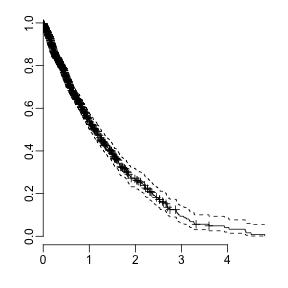 


Maximal concordance


```r
survConcordance(surv ~ risk)
```

```
## Call:
## survConcordance(formula = surv ~ risk)
## 
##   n= 1000 
## Concordance= 0.7392 se= 0.01574
## concordant discordant  tied.risk  tied.time   std(c-d) 
##     160759      56707          0          0       6848
```


### Fit model


```r
fit = CoxRFX(Z, surv, groups = groups, sigma0 = 0.1, nu = 0)
```


Plot estimates


```r
par(mfrow = c(2, 2))
boxplot(coef(fit) ~ groups)

plot(sd, sqrt(fit$sigma2))
abline(0, 1)

plot(mu, fit$mu)
abline(0, 1)

plot(a, coef(fit), col = brewer.pal(5, "Set1")[groups])
abline(0, 1)
```

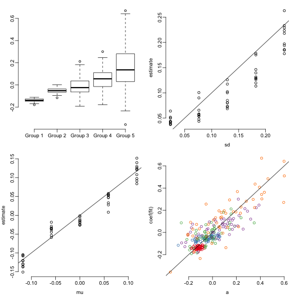 


Compared to standard coxph


```r
coxfit <- coxph(surv ~ Z)
```

```
## Warning: Loglik converged before variable 27 ; beta may be infinite.
```

```
## Warning: X matrix deemed to be singular; variable 145 189
```

```r
plot(a, coef(coxfit), pch = "")
abline(0, 1)
arrows(a, coef(coxfit), a, coef(fit), length = 0.1)
```

```
## Warning: zero-length arrow is of indeterminate angle and so skipped
```

```
## Warning: zero-length arrow is of indeterminate angle and so skipped
```

```
## Warning: zero-length arrow is of indeterminate angle and so skipped
```

```
## Warning: zero-length arrow is of indeterminate angle and so skipped
```

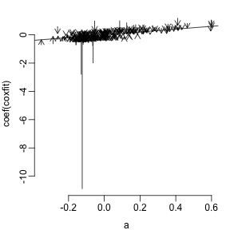 

```r
mean((a - coef(fit))^2)
```

```
## [1] 0.008938
```

```r
mean((a - coef(coxfit))^2)
```

```
## [1] NA
```


Risk contributions


```r
estRiskComponents <- PartialRisk(fit)
estRisk <- rowSums(estRiskComponents)
plot(estRisk, risk)
```

 

```r
plot(survfit(surv ~ cut(estRisk, quantile(estRisk, seq(0, 1, l = 4)))))
```

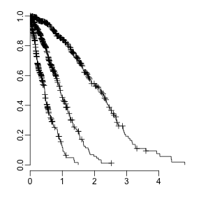 


### Variance components
The variance of the risk can be written as
\[
\begin{aligned}
Var[\lambda] = Var[X \beta] &= Var_X E_\beta[X\beta] + E_X Var_\beta[X\beta] \cr
&= Var_X [X E\beta^T] + E_X [ X^T \Sigma_\beta X]\cr 
&= V + E[\sigma^2_0].
\end{aligned}
\]
The interpretation of the two terms are the following: The first is the predicted variance $V$ using a fixed parameters stemming from the variance in the covariates. 
The second term is the uncertainty of the prediction resulting from the variance in the coefficient estimates. 
It is tempting to approximate the moments of $\beta$ with the estimates from the fit. The covariance $\Sigma_X$ can be estimated across the rows of $X$. The covariance of $\beta$ can be estimated in the fitting process.
\[
\begin{aligned}
Var[\lambda] & \approx Var_X [X^T \hat\beta] + E[X \hat\Sigma_\beta X] \cr
&= \hat\beta^T \Sigma_X \hat\beta + E[X^T \hat\Sigma_\beta X] 
\end{aligned}
\]
The explained variance $V$ involves summations over all terms $j$ of $X_ij$. These can be partitioned into groups g,
\[
\begin{aligned}
V &= \sum_j \sum_k \beta_j \beta_k {\Sigma_X}_{jk} \cr
&= \sum_g \sum_h \Lambda_{gh}, 
\end{aligned}
\]
where $\Lambda_{gh} = \sum_{j \in g}\sum_{k \in h} \beta_j \beta_k {\Sigma_X}_{jk}$. $\Lambda_{gh}$ is the covariance matrix of the risk contributions. Ignoring off-diagonal terms in $\Lambda_{gh}$ the risk can hence be written as
$$ Var[\lambda] \approx \sum_g \Lambda_{gg} + E[\sigma^2_0].$$
The actual implementation is straightforward:


```r
VarianceComponents
```

```
## function(fit, type=c("diag","colSums")){
## 	type="diag"
## 	risk <- PartialRisk(fit = fit)
## 	#residual <- predict(fit, se.fit=TRUE)$se.fit^2
## 	newX <- fit$X - rep(colMeans(fit$X), each=nrow(fit$X))
## 	residual <- rowSums((as.matrix(newX) %*% fit$var) * as.matrix(newX))
## 	
## 	c <- cov(risk, use="complete")
## 	if(type=="diag")
## 		x <- diag(c)
## 	else
## 		x <- rowSums(c)
## 	return(c(x, residual=mean(residual)))
## }
```

```r
varComp <- VarianceComponents(fit)
pie(varComp, main = "Variance components")
```

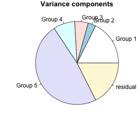 

```r
comp <- lapply(1:10, function(i) {
    surv <- simSurv(risk = risk)
    fit <- CoxRFX(Z, surv, groups = groups, sigma0 = 0.1, nu = 0)
    riskComponents <- sapply(levels(groups), function(g) Z[, groups == g] %*% a[groups == g])
    varComp <- VarianceComponents(fit)
    c(varComp, Residual = mean((predict(fit) - risk)^2))
})

dotchart(c(diag(cov(riskComponents)), Error = mean((predict(fit) - risk)^2)), pch = 19, main = "Variance components", xlim = c(0, 
    max(varComp)), )
for (v in comp) points(v[1:6], seq_along(varComp))
legend("topright", pch = c(19, 1), c("True", "Estd"), bty = "n")
```

 


### Comparison to frailty models
For a factorial set of covariates the model is equivalent to a frailty model


```r
set.seed(42)
par(mfrow = c(3, 3))
for (nLevels in c(5, 10, 50)) for (n in c(2, 10, 50)) {
    f <- factor(rep(1:nLevels, each = n))
    X <- sapply(1:nLevels, `==`, f) + 0
    b <- rnorm(nLevels)
    r <- X %*% b
    s <- simSurv(r)
    frailtyFit <- coxph(s ~ frailty(f, "gaussian"))
    rfxFit <- CoxRFX(X, s, sigma0 = 1, which.mu = NULL)
    if (nLevels <= 5) 
        y <- frailtyFit$coef else y <- frailtyFit$frail
    plot(coef(rfxFit), y, xlab = "CoxRFX est", ylab = "Frailty est", pch = 19, xlim = range(coef(rfxFit)), ylim = range(coef(rfxFit)))
    title(main = paste(nLevels, "levels,", n, "obs"))
    points(coef(rfxFit), b, pch = 1)
    abline(0, 1)
}
```

 


## Missing data
If we a proportion missing data $X_m$ and observed data $X_o$, we can impute predictions using the correlation structure $\Sigma_X$ of the training data set.
Under normality assumptions one can use the covariance matrix from the training data to obtain the conditional (posterior) distribution
of the missing data:
\[ \begin{aligned} 
X_m | X_o & \sim N(\mu_m^*, \Sigma_m^*) \cr
\mu_m^* &= \mu_m + \Sigma_{mo} \Sigma_{oo}^{-1} (X_o - \mu_o) \cr
\Sigma_m^* &= \Sigma_{mm} - \Sigma_{mo} \Sigma_{oo}^{-1} \Sigma_{om}.
\end{aligned} \]

As the risk predictions are linear in $X$ the distribution of the prediction error is given by
\[ \begin{aligned}
E[\lambda | X_o, \beta] &= X_o \beta_o + \mu_m^* \beta_m \cr
Var[\lambda | X_o, \beta ] &= \beta_m^T \Sigma_m^* \beta_m
\end{aligned} \]
The uncertainty in $\beta$ introduces a second term 
\[ Var[\lambda | X_o] = Var[\lambda | X_o, \beta ] + (X_o - \mu_o, \mu_m^* - \mu_m)^T \Sigma_\beta (X_o -\mu_o, \mu^*_m -\mu_m). \]
The implementation is


```r
PredictRiskMissing
```

```
## function(fit, newX=fit$X, var = c("var","var2")){
## 	var <- match.arg(var)
## 	Sigma <- cov(fit$X)
## 	mu <- colMeans(fit$X)
## 	beta <- fit$coefficients
## 	
## 	.predict <- function(newX, beta, Sigma, mu){
## 		missing <- is.na(newX)
## 		expectedX <- newX
## 		if(any(missing)){
## 			s <- Sigma[missing, !missing] %*% MASS::ginv(Sigma[!missing, !missing])
## 			expectedX[missing] <- mu[missing] + s %*% (newX[!missing] - mu[!missing])
## 			varianceRisk <- beta[missing] %*% (Sigma[missing,missing] - s %*%  Sigma[!missing, missing] ) %*% beta[missing]
## 		}else{
## 			varianceRisk <- 0
## 		}
## 		expectedRisk <- expectedX %*% beta
## 		e <- expectedX - mu
## 		varianceRisk <- e %*% fit[[var]][1:length(fit$coefficients),1:length(fit$coefficients)] %*% e + varianceRisk
## 		return(c(expectedRisk, varianceRisk))
## 	}
## 	predictions <- t(apply(newX, 1, .predict, beta, Sigma, mu))
## 	colnames(predictions) <- c("Expected","Variance")
## 	return(predictions)
## }
```


If nothing is missing this is equivalent to the standard variance estimates of the glm predictors $\sigma^2_i = X_ij {\Sigma_\beta}_{jk} X_ik$:


```r
plot(PredictRiskMissing(fit)[, 2], predict(fit, se.fit = TRUE)$se.fit^2, xlab = "sigma^2 CoxHD", ylab = "sigma^2 coxph")
```

 

```r
for (m in c(0, 0.05, 0.1, 0.5, 0.75, 0.9, 0.95)) {
    par(bty = "L", mfrow = c(1, 2))
    nNewX <- 500
    newX <- fit$X[1:nNewX, ]
    newX[sample(1:length(newX), length(newX) * m, replace = FALSE)] <- NA
    p <- PredictRiskMissing(fit, newX[1:nNewX, ])
    p0 <- risk[1:nNewX]
    plot(p0[1:100], p[1:100, 1], xlab = "True risk", ylab = "Predicted risk", main = paste(100 * m, "% missing", sep = ""), 
        ylim = range(p0), xlim = range(p0))
    segments(p0[1:100], p[1:100, 1] - 2 * sqrt(p[1:100, 2]), p0[1:100], p[1:100, 1] + 2 * sqrt(p[1:100, 2]), col = "#88888844", 
        lwd = 4)
    abline(0, 1)
    legend("topleft", bty = "n", c(paste("Cor =", round(cor(p[, 1], p0), 2), collapse = ""), paste("RSS =", round(mean((p0 - 
        p[, 1])^2), 2), collapse = ""), paste("^RSS =", round(mean(p[, 2]), 2), collapse = "")))
    plot(survfit(surv[1:nNewX] ~ (p[, 1] > median(p[, 1]))), xlab = "Time", ylab = "Survival")
    legend("topright", bty = "n", paste("C = ", round(rcorr.cens(-p[, 1], surv[1:nNewX])[1], 2), collapse = ""))
}
```

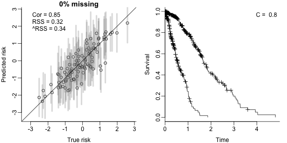 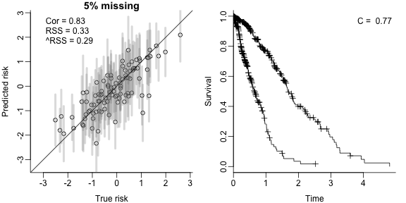 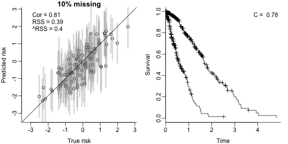 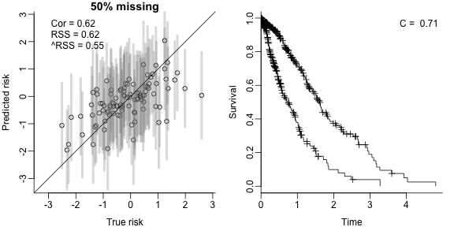 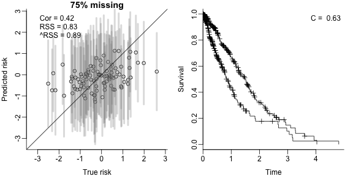 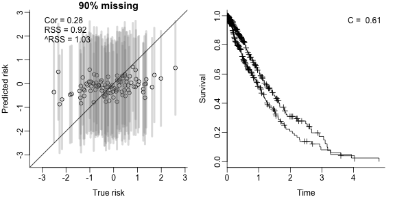 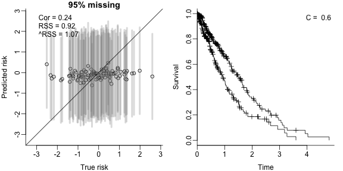 

```r
library(Matrix)
for (rho in -4:-1) {
    m <- 0.75
    par(bty = "L", mfrow = c(1, 3))
    Z <- rmvnorm(nObs, mean = rep(0, nParam), sigma = diag(beta) + as.matrix(bdiag(lapply(1:nGroups, function(i) matrix(10^rho, 
        nrow = nParam/nGroups, ncol = nParam/nGroups)))))
    Z[] <- Z > quantile(Z, 0.75)
    risk = Z %*% a
    risk <- risk/sd(risk)
    s <- simSurv(risk)
    fit <- CoxRFX(Z, s, groups = groups)
    nNewX <- 500
    newX <- fit$X[1:nNewX, ]
    newX[sample(1:length(newX), length(newX) * m, replace = FALSE)] <- NA
    p <- PredictRiskMissing(fit, newX[1:nNewX, ], var = "var2")
    p0 <- risk[1:nNewX]
    plot(p0[1:100], p[1:100, 1], xlab = "True risk", ylab = "Predicted risk", main = paste(100 * m, "% missing, rho=", 10^rho, 
        sep = ""), ylim = range(p0), xlim = range(p0))
    segments(p0[1:100], p[1:100, 1] - 2 * sqrt(p[1:100, 2]), p0[1:100], p[1:100, 1] + 2 * sqrt(p[1:100, 2]), col = "#88888844", 
        lwd = 4)
    abline(0, 1)
    legend("topleft", bty = "n", c(paste("Cor =", round(cor(p[, 1], p0), 2), collapse = ""), paste("RSS =", round(mean((p0 - 
        p[, 1])^2), 2), collapse = ""), paste("^RSS =", round(mean(p[, 2]), 2), collapse = "")))
    plot(a/sd(Z %*% a), fit$coefficients, xlab = "True coef", ylab = "Est. coef")
    abline(0, 1)
    plot(survfit(s[1:nNewX] ~ (p[, 1] > median(p[, 1]))), xlab = "Time", ylab = "Survival")
    legend("topright", bty = "n", paste("C = ", round(rcorr.cens(-p[, 1], s[1:nNewX])[1], 2), collapse = ""))
}
```

    


